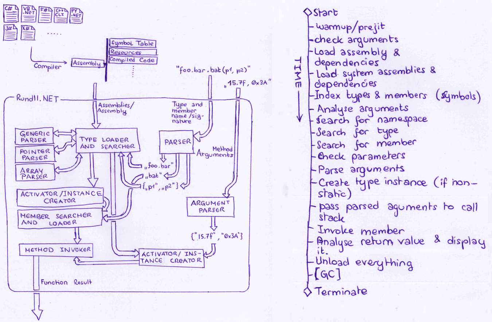

# rundll.net

##Introduction

The `rundll.net`-project is the .NET equivalent of Window's [`rundll.exe`/`rundll32.exe`](https://support.microsoft.com/en-us/kb/164787)-applications, which allows the caller to run functions inside a given dynamic library. The `rundll.net`-application, however, also the executions of private and static methods of the given [library/module/assembly](https://msdn.microsoft.com/en-us/library/ms973231.aspx).

The following image visualizes the basic execution timeline concept of the `rundll.net`-application:<br/>

<br/>

_&lt;TODO: add more text&gt;_

##Usage

The usage is defined as follows:
```
    rundll.net.exe <library> ['new'] <method> [arguments, ...] [options]
```

with the following parameters:

* `libaray`<br/>
  The [.NET assembly](https://msdn.microsoft.com/en-us/library/ms973231.aspx) file name or path
* `'new'`<br/>
  The [`new`](https://msdn.microsoft.com/en-us/library/fa0ab757.aspx)-keyword is optional, but must be passed if the method in question is not a static one (without the quotes).
* `method`<br/>
  Either a [fully qualified namespace, class and method signature](https://msdn.microsoft.com/en-us/library/dfb3cx8s.aspx) or the name of the class (if unique) followed by the unique method name (or optinal parameters to identify the method). Use `.//ctor`, `.//cctor`, `.//dtor` after the parent type to address the type's instance  constructor, static constructor or destructor.
* `arguments`<br/>
  An optional list of arguments (separated by commas without any whitespace), which will be passed as method parameters to the given method.<br/>
A serilaized XML- or JSON-string can be passed with `@XML:""....""` or `@JSON:""....""`, where `....` is the XML- or JSON-string in question. If the parameter shall bede serialized from a JSON- or XML-file, the argument shall be passed as `@JSON::""....""` or `@XML::""....""`, where `....` represents the path to the given JSON- or XML-file.
* `options`<br/>
  An optional list of global options.

The following global options are defined:

* `-d_`, `--depth_`<br/>Sets the return value print depth (the symbol `_` must be a positive integer value between 1 and 7).
* `-v`, `--verbose`<br/>Prints verbose information about the loaded assembly.
* `-s`, `--stdlib`<br/>Includes the .NET standard libraries ([`System.Data.dll`](http://referencesource.microsoft.com/#system.data,namespaces), [`System.dll`](http://referencesource.microsoft.com/#system,namespaces) and [`System.Core.dll`](http://referencesource.microsoft.com/#system.core,namespaces)).<br/>
* `-w`, `--wpflib`<br/>Includes the .NET WPF framework libraries ([`System.Xaml.dll`](http://referencesource.microsoft.com/#System.Xaml,namespaces), [`PresentationCore.dll`](http://referencesource.microsoft.com/#PresentationCore,namespaces), [`PresentationFramework.dll`](http://referencesource.microsoft.com/#PresentationFramework,namespaces), [`WindowsFormsIntegration.dll`](http://referencesource.microsoft.com/#WindowsFormsIntegration,namespaces) and [`WindowsBase.dll`](http://referencesource.microsoft.com/#WindowsBase,namespaces)).<br/>


  _Note: The .NET core framework library [`mscorlib.dll`](http://referencesource.microsoft.com/#mscorlib,namespaces) is always included._
* `-u`, `--uclib`<br/>Includes the .NET library `uclib`
* `-h`, `--help`<br/>Displays this help page.
                
Valid usage examples are:
```
    rundll.net mscorlib.dll System.IntPtr.Size -d2
    rundll.net /root/Documents/library.olb new ImgLib::Image::Rotate()
    rundll.net \\127.0.0.1\Shares\Public\app.exe new MainWindow.//ctor(string) ""foobar"" --stdlib
```
